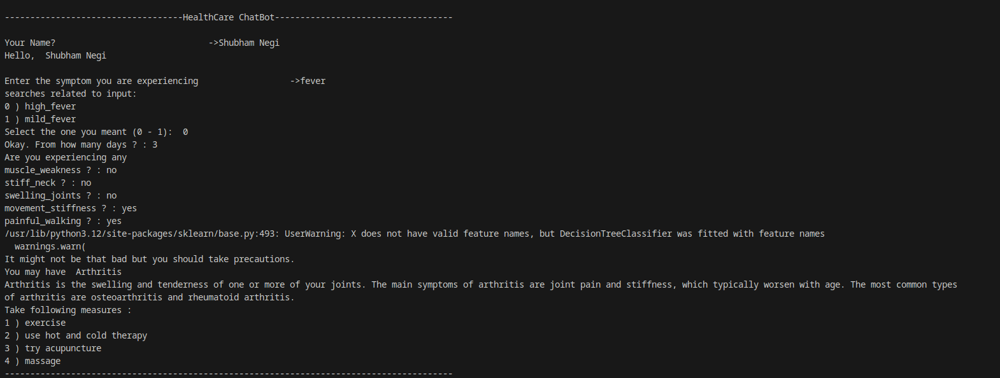

Healthcare Chatbot
This project is a Healthcare Chatbot designed to assist users in diagnosing potential health conditions based on their symptoms. It utilizes machine learning models, including a Decision Tree Classifier and Support Vector Machine (SVM), to predict possible diseases and provide recommendations for further action.

Features
Symptom Analysis: Users can input their symptoms, and the chatbot will analyze the inputs using pattern matching and decision tree classifiers to predict possible diseases.
Severity Calculation: The chatbot calculates the severity of the condition based on the symptoms provided and the number of days the user has been experiencing them.
Consultation Recommendation: Based on the severity of the condition, the chatbot advises whether the user should consult a doctor.
Precautionary Measures: The chatbot provides precautionary measures for the diagnosed condition.
Speech Output: The chatbot can vocalize the diagnosis and recommendations using a text-to-speech engine.
Data

Installation
Clone the repository to your local machine.
Install the required Python packages:
bash
Copy code
pip install pandas numpy scikit-learn pyttsx3
Ensure the data files are placed in the correct directories (Data, MasterData).
Usage
Run the chatbot using the following command:

bash
Copy code
python chat_bot.py
The chatbot will prompt you to enter your symptoms and the number of days you've been experiencing them. Based on your input, it will provide a diagnosis and recommend precautions.

Model Training
The chatbot uses a Decision Tree Classifier and an SVM model trained on the provided data to make predictions. The models are evaluated using cross-validation to ensure accuracy.

